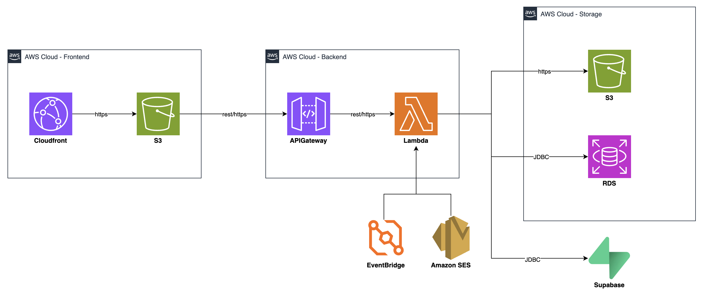

# TissueBank — Sistema de Asignación Automatizada de Tejidos (SAAT)

TissueBank es una empresa colombiana dedicada a la distribución de tejidos ortopédicos donados a médicos cirujanos. El proceso anterior operaba en papel, Excel y WhatsApp; este proyecto lo digitaliza y automatiza de principio a fin: desde la solicitud del doctor hasta el despacho físico del tejido.

## Arquitectura



| Capa | Tecnología |
|---|---|
| Frontend | HTML / CSS / JavaScript estático (sin framework, sin build step) |
| Despliegue frontend | Netlify |
| API | AWS API Gateway (HTTP API, CORS `*`) |
| Backend | AWS Lambda (Python 3.12) |
| Base de datos | PostgreSQL en Supabase |
| Notificaciones | Resend (correo electrónico) |
| Auth | JWT (72h de expiración) |

El repo contiene tres piezas que hoy conviven en distinto grado de madurez:

- **Frontend** (`Index.html`, `App.js`, `Data.js`, `Styles.css`) — `Data.js` expone `window.API` como cliente real de la API (antes era una simulación en memoria; ese contrato de nombres/parámetros se mantuvo igual para no tocar `App.js`, que solo consume `API.*` con `await`).
- **Backend** (`lambdas/`) — funciones Lambda en Python que implementan esos endpoints contra Supabase. Ver detalle abajo.
- **Esquema** (`Schema.sql`) — el esquema real de Postgres/Supabase, ya usado por las Lambdas.

> Nota: `docs/Architecture.png` es una **propuesta de arquitectura objetivo** (CloudFront + S3 + RDS delante del backend), no lo que está desplegado hoy. El MVP actual es más simple: el frontend se sirve directo desde **Netlify** (sin CloudFront/S3 propios) y la base de datos es **Supabase**, sin RDS. Ver `docs/Overview.md` para el detalle del stack realmente en uso.

## Base de datos (Supabase / PostgreSQL)

Definida en `Schema.sql`. Tablas principales, con integridad referencial completa:

- `app_user` — usuarios del sistema (admin y doctores)
- `doctor_profile` — perfil clínico del doctor
- `patient` — pacientes registrados
- `ips` — instituciones prestadoras de salud
- `donor` — donantes, con fechas de extracción y vencimiento
- `implant` — tejidos individuales asociados a cada donante
- `request` — solicitudes médicas de tejido
- `match` — resultado del motor de matching
- `assignment` — aprobación de la asignación
- `dispatch` — gestión del despacho físico

Además incluye las vistas `v_request_status` y `v_request_pipeline`, que derivan el estado de una solicitud recorriendo `match → assignment → dispatch` (mismo criterio que expone el endpoint `GET /requests/{id}/status`).

## Backend (`lambdas/`)

Funciones Lambda en Python 3.12, expuestas vía API Gateway:

| Lambda | Responsabilidad |
|---|---|
| `auth_login_handler` | Autenticación y emisión de JWT |
| `doctor_handler` | CRUD de doctores |
| `patient_handler` | CRUD de pacientes |
| `ips_handler` | CRUD de IPS |
| `implant_handler` | CRUD de implantes/tejidos |
| `request_handler` | CRUD de solicitudes médicas |
| `request_status_handler` | Estado derivado de la solicitud y su pipeline |
| `match_handler` | Gestión de matches: enviar, cancelar, reenviar, respuesta del doctor |
| `assignment_handler` | Aprobación/rechazo de asignaciones |
| `dispatch_handler` | Etiquetado y entrega de despachos |
| `notify_handler` | Envío de correo al doctor vía Resend |

Todas comparten un Layer (`tissuebank-shared-layer`) con:

- `db.py` — conexión a PostgreSQL vía `psycopg2` (pooler de Supabase) y helpers `query` / `query_one` / `transaction`
- `auth.py` — generación y verificación de tokens JWT
- `response.py` — helpers de respuesta HTTP estandarizados

### Variables de entorno (`lambdas/.env`, ver `.env.example`)

```
DB_HOST=your-project.pooler.supabase.com
DB_NAME=postgres
DB_PASSWORD=your-db-password
DB_PORT=6543
DB_USER=postgres.your-project-ref
JWT_SECRET=your-jwt-secret
```

## API

Base URL (API Gateway, HTTP API):

```
https://dml5behlp3.execute-api.us-east-1.amazonaws.com
```

Autenticación: header `Authorization: Bearer <token>` (JWT emitido por `/auth/login`, expira en 72h). Todas las rutas requieren sesión salvo `/auth/login`.

| Método | Ruta | Descripción |
|---|---|---|
| POST | `/auth/login` | Login, devuelve JWT |
| GET | `/doctors` | Listar doctores |
| GET | `/doctors/{id}` | Ver doctor |
| POST | `/doctors` | Crear doctor (devuelve password temporal) |
| PUT | `/doctors/{id}` | Actualizar perfil del doctor |
| PATCH | `/doctors/{id}/status` | Activar/desactivar doctor |
| POST | `/doctors/{id}/reset-password` | Resetear password (devuelve nueva temporal) |
| GET | `/ips` | Listar IPS |
| POST | `/ips` | Crear IPS |
| GET | `/patients?search=` | Buscar paciente por número de identificación |
| POST | `/patients` | Crear paciente |
| GET | `/donors` | Listar donantes |
| GET | `/donors/{id}` | Ver donante |
| POST | `/donors` | Crear donante |
| PUT | `/donors/{id}` | Actualizar donante |
| GET | `/implants` | Listar implantes |
| GET | `/implants/{id}` | Ver implante |
| POST | `/implants` | Crear implante |
| PUT | `/implants/{id}` | Actualizar implante |
| GET | `/requests` | Listar solicitudes |
| GET | `/requests/{id}/status` | Estado derivado del pipeline de la solicitud |
| POST | `/requests` | Crear solicitud |
| GET | `/matches` | Listar matches (filtro opcional `?status=`) |
| POST | `/matches/run` | Ejecutar motor de matching |
| POST | `/matches/{id}/send` | Enviar match al doctor |
| POST | `/matches/{id}/cancel` | Cancelar envío |
| POST | `/matches/{id}/resend` | Reenviar notificación |
| PUT | `/matches/{id}/doctor-response` | Registrar aprobación/rechazo del doctor |
| GET | `/assignments` | Listar asignaciones |
| PUT | `/assignments/{id}/approve` | Aprobar asignación (crea el despacho) |
| PUT | `/assignments/{id}/reject` | Rechazar asignación |
| GET | `/dispatches` | Listar despachos |
| PUT | `/dispatches/{id}/label` | Etiquetar despacho |
| PUT | `/dispatches/{id}/deliver` | Marcar despacho como entregado |

## Roles de usuario

| Rol | Acceso |
|---|---|
| Admin | Todo el sistema — solicitudes, tejidos, matches, asignaciones, despachos |
| Doctor | Sus propias solicitudes y los matches pendientes de su aprobación |

Doctor accounts se provisionan desde el panel **Doctores** del admin, generando una contraseña temporal de un solo uso.

## Flujo del proceso

1. Doctor crea una solicitud médica con tipo de tejido y dimensiones requeridas.
2. Admin registra donantes e implantes con dimensiones y estado.
3. Admin ejecuta el motor de matching (`POST /matches/run`).
4. El motor evalúa compatibilidad: tipo de tejido, dimensiones ±5mm, sexo (si aplica), frescura del tejido.
5. Admin revisa los matches detectados y notifica al doctor por correo (Resend).
6. Doctor aprueba o rechaza el match desde su panel.
7. Admin aprueba la asignación → se crea el despacho automáticamente.
8. Admin etiqueta el despacho, lo marca en camino y luego entregado.

Este flujo mapea directamente a los paneles del frontend: **Solicitantes → Recomendaciones → Asignaciones → Etiquetado**.

### Motor de matching

Scoring ponderado, score mínimo 60/100:

| Factor | Peso |
|---|---|
| Compatibilidad alto (mm) | 35% |
| Compatibilidad ancho (mm) | 35% |
| Frescura del tejido (días restantes / vida útil) | 20% |
| Coincidencia de sexo donante-paciente | 10% |

Filtros obligatorios: tipo de tejido exacto, dimensiones dentro de ±5mm, sexo del donante cuando `sexo_importante = true`, implante en estado `disponible`, sin match activo previo para ese par. Máximo 3 candidatos por solicitud, ordenados por score descendente.

### Estados del pipeline

- **Match:** `detectado → enviado → aprobado_doctor / rechazado_doctor → aprobado_admin / rechazado_admin / invalidado`
- **Assignment:** `pendiente → aprobada / rechazada`
- **Dispatch:** `por_etiquetar → etiquetado → en_camino → entregado`

## Correr el frontend localmente

No hay build step ni dependencias. Basta con abrir `Index.html` con la extensión **Live Server** de VS Code (clic derecho → "Open with Live Server"). El frontend apunta directo al API Gateway real (`API_BASE` en `Data.js`), así que localmente ya se trabaja contra los datos de Supabase — no hace falta levantar backend.

⚠️ Los archivos están nombrados en mayúscula (`Index.html`, `App.js`, `Data.js`, `Styles.css`) pero `Index.html` los referencia en minúscula. Esto funciona en macOS/Windows (filesystem case-insensitive) pero falla en Linux o en hosts que distingan mayúsculas/minúsculas.

## Documentación adicional

`docs/` contiene los diagramas de arquitectura (`Architecture.drawio`, `AWS Architecture.drawio`, `Global Architecture.drawio`, abrir con [diagrams.net](https://app.diagrams.net)), `Overview.md` (resumen funcional y técnico) y `Tissue.pdf`.
